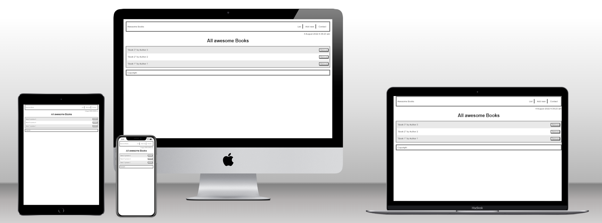

# Project: Awesome Books

> Awesome books website is a website that allows users to add/remove books from a list.


## Built With

- Major languages - HTML, CSS and Javascript

## Preview of website



## Live Demo

[Live Demo Link](https://samlorlah.github.io/awesome-books/)

## Getting Started

To get a local copy up and running follow these simple example steps.

### Prerequisites

- HTML5 & CSS3 
- JavaScript
- VSCode (or any other text editor)
- Git
- GitHub
- Command line/Terminal

### Setup

From the command line, do the following steps below:

1. Clone the projects' repository into your machine.

```bash
# Clone this repository
$ git clone git@github.com:samlorlah/awesome-books.git

```
2. Change directory/Go into the repository with the command below.

```bash
$ cd awesome-books

```

## Authors

👤 **Oluwamuyiwa Fawole**

- GitHub: [@samlorlah](https://github.com/samlorlah)
- Twitter: [@samlorlah](https://twitter.com/samlorlah)
- LinkedIn: [Oluwamuyiwa Fawole](https://www.linkedin.com/in/muyiwa-fawole/)

👤 **Losalini Rokocakau**

- GitHub: [@chelmerrox](https://github.com/chelmerrox)
- Twitter: [@chelmerrox](https://twitter.com/chelmerrox)
- LinkedIn: [Losalini Rokocakau](https://www.linkedin.com/in/losaini-rokocakau/)


👤 **Jon Zuka**

- GitHub: [@gnuion](https://github.com/gnuion)
- Twitter: [@gnuion](https://twitter.com/gnuion)
- LinkedIn: [Jon Zuka](https://www.linkedin.com/in/jonzuka/)

## 🤝 Contributing

Contributions, issues, and feature requests are welcome!

Feel free to check the [issues page](https://github.com/samlorlah/awesome-books/issues).

## Show your support

Give a ⭐️ if you like this project!

## Acknowledgments

 - Microverse
 - Team members
 - Code reviewers

## 📝 License

This project is [MIT](./MIT.md) licensed.